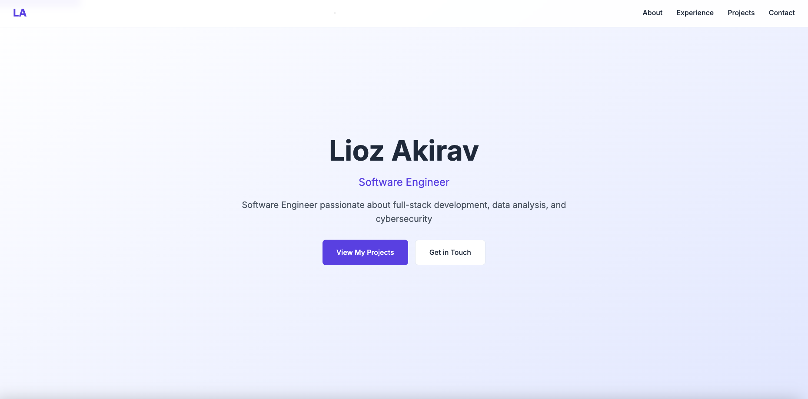

# Personal Portfolio Website

A modern, responsive portfolio website showcasing my professional experience, projects, and skills. Built with HTML5, CSS3, and vanilla JavaScript, focusing on performance, accessibility, and security.

[View Live Site](https://www.lioz.dev/)

## Overview

- 🎨 Modern and clean design
- 📱 Fully responsive layout
- ⚡ Optimized performance
- ♿ WCAG compliant accessibility
- 🔒 Enhanced security features
- 🌐 SEO optimized

## Technologies Used

- HTML5
- CSS3
- Vanilla JavaScript
- AWS Amplify (hosting)

## Features

### About Section
- Professional background
- Technical skills overview
- Areas of expertise

### Experience Section
- Professional timeline
- Key achievements
- Company highlights

### Projects Section
- Featured projects showcase
- Technical implementations

### Contact Section
- Professional contact form
- Social media integration
- Direct communication channels

## Technical Highlights

### Performance
- WebP images with fallbacks
- Lazy loading implementation
- Resource preloading
- Optimized asset delivery

### Security
- Content Security Policy (CSP)
- HTTP security headers
- Form spam protection
- Secure resource loading

### CI/CD Pipeline
- Automated code validation (HTML, CSS, JS)
- Security checks for static files
- Accessibility testing
- AWS Amplify deployment integration

## Contact

- Website: [lioz.dev](https://www.lioz.dev)
- GitHub: [@Lioo7](https://github.com/Lioo7)
- LinkedIn: [Lioz Akirav](https://www.linkedin.com/in/lioz-akirav)

## License

MIT License - see the [LICENSE](LICENSE) file for details.